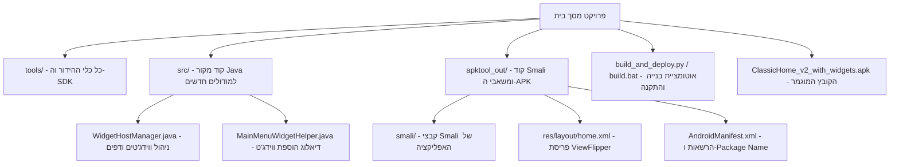

# מפת הקשר והנחיות פיתוח - שדרוג מסך הבית Qin 1s+

מסמך זה מהווה מפת דרכים מלאה ומרכזית עבור כל צוות הפיתוח להמשך תחזוקה, פיתוח והרחבה של מסך הבית.

---

## 📱 סקירת הפרויקט והקובץ המוגמר

- **קובץ ה-APK המוגמר והחתום**:
  `c:\Users\a0527\Desktop\מסך בית\ClassicHome_v2_with_widgets.apk`
- **שם החבילה**: `com.sprd.simple.launcher.mod`
- **מכשיר יעד**: Xiaomi / Duoqin Qin 1s / 1s+ (Android 4.4.4 KitKat - API 19)

---

## 🛠️ ארגז הכלים המקומי (`/tools`)
כל הכלים הדרושים להנדסה לאחור, הידור, חתימה ובדיקה הועתקו ונשמרים באופן מקומי בתוך התיקייה `tools/`:
1. **`tools/android-19/android.jar`** - ה-SDK הרשמי של Android 4.4.4 API 19 עבור הידור Java.
2. **`tools/d8.jar`** - מנוע D8 של גוגל להמרת קבצי `.class` ל-`classes.dex`.
3. **`tools/apktool/apktool.jar`** - כלי Apktool v2.11.1 לפירוק והרכבת ה-APK וקובצי ה-Smali.
4. **`tools/zipalign.exe`** - כלי יישור בינארי (4-byte alignment) של קובץ ה-APK.
5. **`tools/apksigner.jar`** - כלי חתימה רשמי של Android התומך בחתימות v1, v2 ו-v3.
6. **`tools/aapt.exe` & `tools/aapt2.exe`** - כלי עיבוד ומשאבים של אנדרואיד.
7. **`tools/adb/`** - כלי ADB וקבצי ה-DLL הדרושים לתקשורת והתקנה ישירה במכשיר.

---

## 📂 מבנה התיקיות והקבצים בפרויקט



---

## 🎯 הפיצ'רים שמומשו במוד

### 1. מסך ראשי (עמוד 0) - מצב צפייה בלבד (View-Only)
- הווידג'ט שמוצב במסך הראשי מוגדר במצב **צפייה בלבד** (`setDescendantFocusability(FOCUS_BLOCK_DESCENDANTS)`, ביטול פוקוס ואירועי מגע).
- בכך נשמרת פעולה חלקה 100% של קיצורי הדרך, מקשי ה-D-Pad והשעון, ללא תפיסת פוקוס על ידי הווידג'ט.

### 2. ריבוי עמודי ווידג'טים דינמיים (`ViewFlipper`)
- מעבר לעמוד הווידג'טים מתבצע בלחיצה על מקש **סולמית (`#`)** (קוד מקש 18 / `0x12`).
- תמיכה במספר עמודים דינמי (`0 -> 1 -> 2 -> ... -> 0`).
- לחיצה על מקש **חזור (Back)** (קוד מקש 4 / `0x4`) מכל עמוד ווידג'טים מחזירה ישירות למסך הראשי (0).

### 3. הסרת ווידג'טים באמצעות מקש Menu (מקש שמאלי)
- בעמודי הווידג'טים (עמוד 1 ומעלה), לחיצה על מקש **Menu (מקש שמאלי / קוד 82)** פותחת דיאלוג עם רשימת הווידג'טים בעמוד הנוכחי לבחירה והסרה מיידית.

### 4. הוספת ווידג'טים מתוך תפריט היישומים
- לחיצה ארוכה על כל אפליקציה בתפריט הראשי (`MainMenuActivity`) פותחת דיאלוג ייעודי:
  - "הוסף למסך הראשי (צפייה בלבד)"
  - "הוסף לעמוד ווידג'טים 1"
  - "הוסף לעמוד ווידג'טים 2" (או עמוד חדש)
  - "פרטי יישום"

---

## 🚀 פקודות הפעלה ובנייה לצוות

### הרצת בנייה והתקנה אוטומטית:
- **באמצעות קובץ Batch ב-Windows**:
  לחץ פעמיים על הקובץ [build.bat](file:///c:/Users/a0527/Desktop/%D7%9E%D7%A1%D7%9A%20%D7%91%D7%99%D7%AA/build.bat).
- **באמצעות שורת הפקודה**:
  ```powershell
  python build_and_deploy.py
  ```

הסקריפט מבצע אוטומטית:
1. הידור קוד ה-Java שב-`src/` ויצירת קבצי Smali.
2. הזרקת קבצי ה-Smali לתוך `apktool_out/smali/`.
3. בניית ה-APK באמצעות `apktool b`.
4. יישור 4-בתים באמצעות `zipalign`.
5. חתימת ה-APK באמצעות `apksigner` ומפתח ה-`debug.keystore`.
6. בדיקת חיבור ADB והתקנה אוטומטית על המכשיר (אם מחובר).
